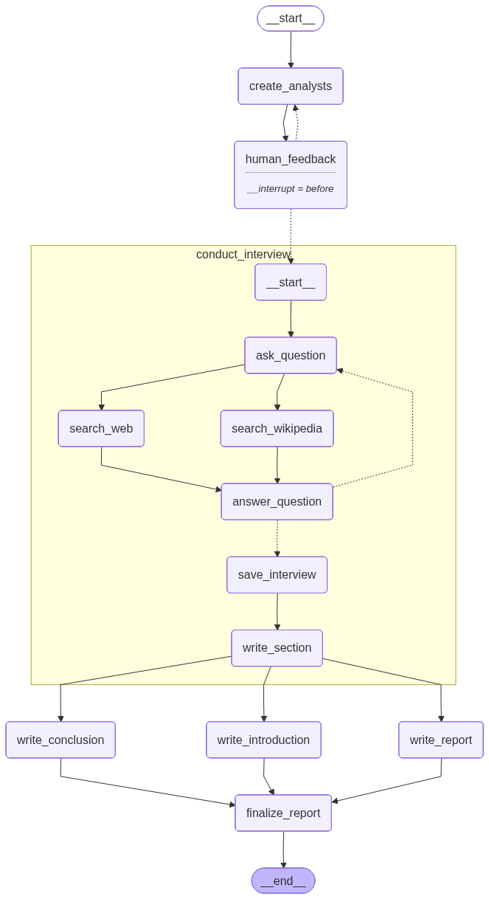
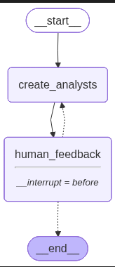
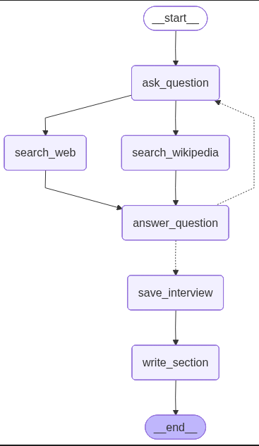

# 🕵️‍♂️ Research Assistant Bot


A web-based **Autonomous Research Agent** powered by LangGraph, Groq, and Llama 3. It orchestrates a team of AI analysts to plan, research, and synthesize detailed reports on any topic using real-time web data.

🔗 **Live Demo:** 
[text](https://research-assistant-bot-qmfr.vercel.app/)
---

## 🧠 How it Works

This project implements a **Multi-Agent "Map-Reduce" Architecture**. Instead of a single LLM trying to write a report, the system breaks the task down:

1.  **The Planner (Llama 3 70B):** Acts as the Editor-in-Chief. It breaks a user's topic into distinct sub-topics and assigns them to specific Analyst Personas.
2.  **The Workers (Llama 3 8B/17B):** These parallel agents conduct deep-dive research. They can:
    * Generates targeted search queries.
    * Scrape web data (Tavily API) and Wikipedia.
    * Conduct "interviews" with an expert AI to extract insights.
3.  **The Reviewer (Human-in-the-Loop):** The user can pause the process to approve, reject, or modify the analyst team before research begins.
4.  **The Writer (Llama 3 70B):** Synthesizes all analyst memos into a cohesive, cited final report.

### 🏗️ Architecture Diagrams

| **1. The Main Graph** | **2. The Analyst Subgraph** | **3. The Interview Subgraph** |
| :---: | :---: | :---: |
|  |  |  |
| *Orchestrates the entire lifecycle.* | *Generates & Refines Personas.* | *Conducts Research & Summaries.* |

---

## ✨ Key Features

* **Hybrid Model Architecture:** Uses **Llama 3 70B** for high-level reasoning (Planning/Writing) and **Llama 3 17B** for high-throughput tasks (Search/Summary) to optimize quality vs. cost.
* **Human-in-the-Loop (HITL):** Users can review and edit the generated AI analysts before they start working.
* **Parallel Execution:** Multiple analysts research simultaneously using Python's `async` capabilities.
* **Rate Limit Protection:** Implements **Exponential Backoff & Jitter** to handle API rate limits gracefully on free tiers.
* **Fact-Checked Citations:** Programmatically extracts URLs from search results to ensure the final report has accurate `[1]`, `[2]` citations.

---

## 📂 Project Structure

```text
Research-Assistant-Bot/
├── app.py                 # Flask Backend & Session Management
├── requirements.txt       # Project Dependencies
├── vercel.json            # Vercel Deployment Config
├── src/
│   ├── config.py          # API Keys, Model Init & Rate Limit Logic
│   ├── helper.py          # LangGraph Nodes, Edges & Compilation
│   └── prompt.py          # System Prompts & Instructions
├── static/
│   ├── style.css          # Custom UI Styling
│   └── images/            # Architecture Diagrams
└── templates/
    ├── chat.html          # Main Chat Interface
    └── how_it_works.html  # Explainer Page
```

## 🚀 Setup & Installation

### 1. Clone the Repository
```bash
git clone https://github.com/yourusername/research-assistant-bot.git
cd research-assistant-bot
```

### 2. Create a Virtual Environment
```bash
python -m venv venv
source venv/bin/activate  # On Windows: venv\Scripts\activate
```

### 3. Install Dependencies
```bash
pip install -r requirements.txt
```

### 4. Configure API Keys
```bash
GROQ_API_KEY=gsk_...
TAVILY_API_KEY=tvly-...
```

### 5. Run the Application
```bash
python app.py
```

## 🛠️ Tech Stack

Backend: Flask, Python 3.10+

AI Framework: LangGraph, LangChain

LLMs: Meta Llama 3 (via Groq API)

Search: Tavily Search API, Wikipedia

Frontend: HTML5, Bootstrap 4, jQuery

## License
This project is licensed under the MIT License.